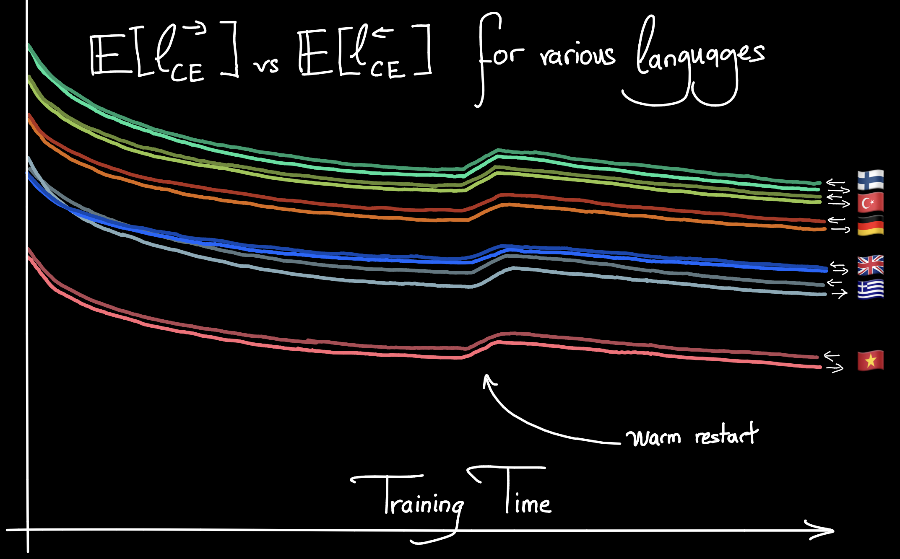

ICML 2024: [Oral](https://icml.cc/virtual/2024/oral/35521) | [Paper](https://icml.cc/virtual/2024/poster/33931)  
Arxiv paper: [here](https://arxiv.org/abs/2401.17505)  
Code used in our experiments: [here](https://github.com/frotaur/LLM-Arrows-of-Time)

We study the probabilistic modeling performed by Autoregressive Large Language Models (LLMs) through the angle of time directionality, addressing a question first raised in (Shannon, 1951). For large enough models, we empirically find a time asymmetry in their ability to learn natural language: a difference in the average log-perplexity when trying to predict the next token versus when trying to predict the previous one. This difference is at the same time subtle and very consistent across various modalities (language, model size, training time, ...). Theoretically, this is surprising: from an information-theoretic point of view, there should be no such difference. We provide a theoretical framework to explain how such an asymmetry can appear from sparsity and compu- tational complexity considerations, and outline a number of perspectives opened by our results.

---


English vs French validation losses (French training losses in the zoom-in, early loss values cropped for readability). 





BW/FW losses percentage difference for different context lengths.





Validation loss curves for several languages, in FW and BW training. Consistently, during training, the BW loss is higher than its FW counterpart. This persists through the warm restart of the learning rate, which causes a bump in the loss.





Models loss at the end of training vs → sparsity.




---



---
